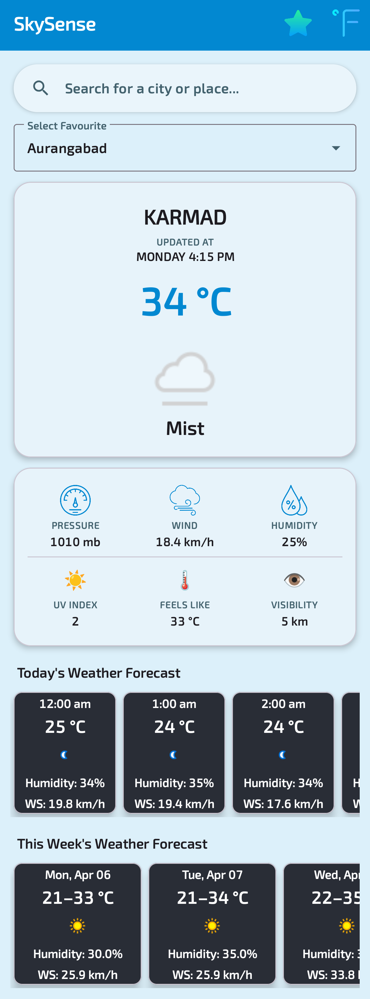
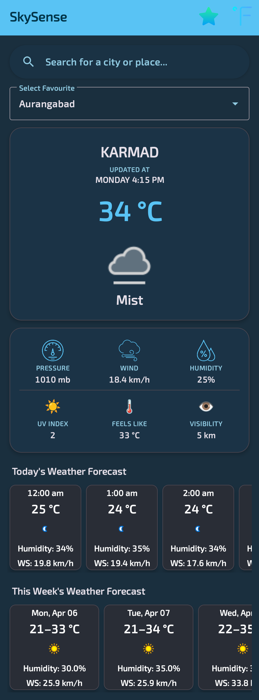

<div align="center">

# 🌤️ SkySense

### A modern Android weather app built with Java, Material 3, and Retrofit

[](https://developer.android.com)
[-brightgreen)](https://developer.android.com/studio/releases/platforms)
[-blue)](https://developer.android.com/studio/releases/platforms)
[](https://m3.material.io)
[](https://square.github.io/retrofit/)
[](LICENSE)

<br/>

*Real-time weather · 3-day forecast · Hourly breakdown · Smart caching*

</div>

---

## 📖 Table of Contents

- [About](#-about)
- [Features](#-features)
- [Screenshots](#-screenshots)
- [Tech Stack](#-tech-stack)
- [Project Structure](#-project-structure)
- [Getting Started](#-getting-started)
  - [Prerequisites](#prerequisites)
  - [API Keys](#api-keys)
  - [local.properties Setup](#localproperties-setup)
  - [Build & Run](#build--run)
- [Architecture Overview](#-architecture-overview)
- [Key Implementation Details](#-key-implementation-details)
  - [Retrofit Network Layer](#retrofit-network-layer)
  - [Smart Caching](#smart-caching)
  - [Secure API Key Handling](#secure-api-key-handling)
- [Dependencies](#-dependencies)
- [Contributing](#-contributing)
- [License](#-license)

---

## 🌍 About

**SkySense** is a clean, fully-featured Android weather application that shows you real-time conditions and forecasts for any location on Earth. Whether you're checking the weather at home, searching for a city across the world, or saving your favourite destinations, SkySense has you covered with a polished Material 3 UI that works beautifully on every Android device from Android 8.0 all the way up to Android 16 with full edge-to-edge support.

> Weather data is powered by [WeatherAPI.com](https://www.weatherapi.com/) and location search is powered by the [Google Places SDK](https://developers.google.com/maps/documentation/places/android-sdk/overview).

---

## ✨ Features

| Feature | Description |
|---|---|
| 📍 **Auto Location** | Detects your current location automatically on first launch using the Fused Location Provider |
| 🔍 **Place Search** | Full Google Places Autocomplete (search any city, landmark, or address worldwide) |
| ⭐ **Favourites** | Save and quickly switch between multiple locations with one tap |
| 🌡️ **Current Conditions** | Temperature, condition, pressure, wind speed, humidity, UV index, feels-like, and visibility |
| 🕐 **Hourly Forecast** | Hour-by-hour breakdown for the current day |
| 📅 **3-Day Forecast** | Daily min/max temperatures with condition icons for the week ahead |
| 🔄 **Unit Toggle** | Switch between Celsius and Fahrenheit instantly (no refetch needed) |
| 🔃 **Pull-to-Refresh** | Force-refresh the latest data with a swipe-down gesture |
| 💾 **Smart Cache** | 1-hour on-device cache keeps the app useful even offline |
| 🌙 **Dark Mode** | Full Material 3 dynamic dark theme support |

---

## 📸 Screenshots

<!-- > _Add your screenshots to a `/screenshots` folder in the repository root and uncomment the lines below._ -->

<p align="center">
  
  &nbsp;&nbsp;
  
</p>

<!--
<p align="center">
  
  &nbsp;&nbsp;
  
  &nbsp;&nbsp;
  
</p>
<p align="center">
  
  &nbsp;&nbsp;
  
</p>
-->

---

## 🛠️ Tech Stack

| Layer | Technology |
|---|---|
| **Language** | Java 17 |
| **UI Framework** | Material 3 Components (`Theme.Material3.DayNight.NoActionBar`) |
| **Networking** | Retrofit 2 + OkHttp 3 |
| **JSON Parsing** | Gson (via Retrofit converter) |
| **Image Loading** | Picasso |
| **Location** | Google Fused Location Provider |
| **Place Search** | Google Places SDK v5 |
| **Caching** | SharedPreferences-backed weather cache (1-hour TTL) |
| **Build** | Gradle 9 · Android Gradle Plugin 9.x · `buildConfig` enabled |

---

## 🗂️ Project Structure

```
app/src/main/
├── java/com/sense/sky/
│   ├── api/
│   │   ├── WeatherApiClient.java      # Retrofit singleton (OkHttp + timeouts + logging)
│   │   └── WeatherApiService.java     # @GET interface for WeatherAPI endpoints
│   ├── model/
│   │   └── WeatherResponse.java       # Gson POJO tree (Location, Current, Forecast, Hour, Day, etc)
│   ├── DaysAdapter.java               # RecyclerView adapter (3-day forecast cards)
│   ├── DaysModel.java                 # Data model for daily forecast
│   ├── HoursAdapter.java              # RecyclerView adapter (hourly forecast cards)
│   ├── HoursModel.java                # Data model for hourly forecast
│   ├── MainActivity.java              # Single-activity app entry point
│   └── WeatherCacheManager.java       # SharedPreferences cache with TTL helpers
│
└── res/
    ├── layout/
    │   ├── activity_main.xml          # CoordinatorLayout root (edge-to-edge safe)
    │   ├── hours_item.xml             # Hourly card layout
    │   ├── days_item.xml              # Daily card layout
    │   └── list_items.xml             # Favourites dropdown item
    ├── menu/
    │   └── menu_actionbar.xml         # Toolbar menu (favourites star + °C/°F toggle)
    ├── values/
    │   ├── colors.xml
    │   ├── strings.xml
    │   └── themes.xml                 # Material 3 light theme with full token palette
    └── values-night/
        ├── strings.xml
        └── themes.xml                 # Material 3 dark theme
```

---

## 🚀 Getting Started

### Prerequisites

Before cloning, make sure you have the following installed:

- **Android Studio** Panda 2 (2025.3.2) or newer [Download](https://developer.android.com/studio)
- **JDK 17+** bundled with recent Android Studio releases
- **Android SDK** with API 26–36 platforms installed
- A physical or emulated device running **Android 8.0 (API 26)** or higher
- Active **internet connection** during first build (Gradle dependency download)

---

### API Keys

SkySense requires two API keys. Both are **free to obtain**:

#### 1. WeatherAPI Key

1. Go to [weatherapi.com](https://www.weatherapi.com/) and create a free account.
2. Navigate to **Dashboard → API Key**.
3. Copy your key (the free tier includes 1 million calls/month, 3-day forecast, and hourly data. That's more than enough)

#### 2. Google Places API Key

1. Go to the [Google Cloud Console](https://console.cloud.google.com/).
2. Create a new project (or select an existing one).
3. Navigate to **APIs & Services → Library** and enable both:
   - **Places API (New)**
   - **Maps SDK for Android** *(needed for LatLng)*
4. Navigate to **APIs & Services → Credentials** and click **Create Credentials → API Key**.
5. *(Recommended)* Restrict the key to **Android apps** and add your app's package name (`com.sense.sky`) and SHA-1 signing fingerprint.

> **💡 Tip:** Get your debug SHA-1 fingerprint with:
> ```bash
> keytool -list -v -keystore ~/.android/debug.keystore -alias androiddebugkey -storepass android -keypass android
> ```

---

### `local.properties` Setup

SkySense reads API keys from `local.properties` so they are **never committed to version control**. `local.properties` is already listed in `.gitignore` (you only need to add your keys)

Open (or create) `local.properties` in the **project root** (the same folder as `settings.gradle`) and add:

```properties
# Android SDK path (already here if you've opened the project in Android Studio)
sdk.dir=C\:\\Users\\<USER>\\AppData\\Local\\Android\\Sdk

# SkySense API keys (add these two lines)
WEATHER_API_KEY="your_weatherapi_key_here"
MAPS_API_KEY="your_google_places_api_key_here"

# Keystore Credentials (If created keystore for SHA-1 or SHA-256)
STORE_PASSWORD=your_store_password_here
KEY_ALIAS=your_key_alias_here
KEY_PASSWORD=your_key_password_here
```

Then expose them to your code via `app/build.gradle` inside `defaultConfig`:

```groovy
def localProperties = new Properties()
localProperties.load(new FileInputStream(rootProject.file("local.properties")))

android {
    signingConfigs {
        release {
            storeFile file('../SkySense.keystore')
            storePassword localProperties['STORE_PASSWORD']
            keyAlias localProperties['KEY_ALIAS']
            keyPassword localProperties['KEY_PASSWORD']
        }
    }

    defaultConfig {
        // … other config …

        buildConfigField "String", "MAPS_API_KEY", localProperties['MAPS_API_KEY']
        buildConfigField "String", "WEATHER_API_KEY", localProperties['WEATHER_API_KEY']
    }

    buildFeatures {
        buildConfig true
    }

    // … other config …
}
```

> ⚠️ **Important:** You must add the two `buildConfigField` lines to `app/build.gradle` yourself if they are not already present, they are read-only build-time constants and must never be hardcoded in source files.

They are then consumed in `MainActivity.java` exactly like this:

```java
public static final String WEATHER_API_KEY = BuildConfig.WEATHER_API_KEY;
public static final String MAPS_API_KEY    = BuildConfig.MAPS_API_KEY;
```

---

### Build & Run

```bash
# 1. Clone the repository
git clone https://github.com/your-username/SkySense.git
cd SkySense

# 2. Add your keys to local.properties (see section above)

# 3. Open in Android Studio
#    File → Open → select the SkySense folder

# 4. Let Gradle sync finish, then run on device or emulator
#    Run → Run 'app'  (or Shift+F10)
```

> **First launch:** The app will ask for Location permission. Grant it to load weather for your current position automatically. You can also use the search bar to look up any city without granting location access.

---

## 🏗️ Architecture Overview

SkySense follows a straightforward single-activity pattern with a clear separation between the **network layer**, **data models**, and **UI**:

```
┌──────────────────────────────────────────────────────┐
│                   MainActivity                       │
│   (UI, permission handling, favourites, unit toggle) │
└────────────────────┬─────────────────────────────────┘
                     │ calls
         ┌───────────▼────────────┐
         │   WeatherApiClient     │  Retrofit singleton
         │   (OkHttp, timeouts)   │  + logging interceptor
         └───────────┬────────────┘
                     │ enqueue()
         ┌───────────▼────────────┐
         │   WeatherApiService    │  @GET interface
         │   /v1/forecast.json    │
         └───────────┬────────────┘
                     │ Gson deserialises
         ┌───────────▼─────────────┐
         │     WeatherResponse     │  Typed POJO tree
         │   (Location, Current,   │
         │   Forecast, Hour, Day)  │
         └───────────┬─────────────┘
                     │
         ┌───────────▼────────────┐
         │  WeatherCacheManager   │  SharedPreferences
         │  (1-hour TTL cache)    │  keyed by lat,lon
         └────────────────────────┘
```

The app does **not** use ViewModel or LiveData, It's a deliberately lean single-activity design that keeps all logic in `MainActivity`. This makes it easy to follow and extend without a steep architecture learning curve.

---

## 🔑 Key Implementation Details

### Retrofit Network Layer

The benefits of **Retrofit 2 + OkHttp 3** are:

- **Type-safe responses**: Gson automatically maps JSON into `WeatherResponse` POJOs; no more `response.getJSONObject("current").getString("temp_c")`
- **Configurable timeouts**: connect: 15s, read: 20s, write: 15s
- **Debug logging**: `HttpLoggingInterceptor` prints request URLs and response codes to Logcat when `BuildConfig.DEBUG` is `true`, and is completely silent in release builds
- **Thread safety**: the `WeatherApiClient` singleton is double-checked locked so it's safe to call from multiple places

```java
// WeatherApiService.java (the entire network contract in 8 lines)
@GET("v1/forecast.json")
Call<WeatherResponse> getForecast(
    @Query("key")    String apiKey,
    @Query("q")      String query,   // "lat,lon"
    @Query("days")   int    days,
    @Query("aqi")    String aqi,
    @Query("alerts") String alerts
);
```

---

### Smart Caching

The cache uses **SharedPreferences** keyed by location (rounded to 4 decimal places, ≈11 m precision) with a 1-hour TTL:

```
Cache key format:  "23.2599,77.4126"
Stored values:     weatherData_<key>  →  JSON string
                   timestamp_<key>    →  epoch ms
```

Cache hit logic:
1. **No internet + cache exists** → serve stale cache immediately (app works fully offline)
2. **Internet + cache fresh (< 1 hr)** → serve cache, skip network call
3. **Internet + cache stale** → fetch from network, update cache
4. **Network error + cache exists** → serve stale cache, show toast
5. **Network error + no cache** → show error message

Pull-to-refresh bypasses the TTL check and always fetches fresh data.

---

### Secure API Key Handling

API keys are kept out of source code entirely:

```
local.properties          ← your keys live here (git-ignored)
        ↓
app/build.gradle          ← reads via properties.getOrDefault()
        ↓
BuildConfig.java          ← generated at build time (git-ignored)
        ↓
MainActivity.java         ← reads BuildConfig.WEATHER_API_KEY
```

This means your keys are **never in any file that gets committed to git**, and collaborators simply add their own `local.properties` with their own keys.

---

## 📦 Dependencies

```groovy
// UI
implementation 'androidx.appcompat:appcompat:1.7.1'
implementation 'com.google.android.material:material:1.13.0'
implementation 'androidx.constraintlayout:constraintlayout:2.2.1'
implementation 'androidx.swiperefreshlayout:swiperefreshlayout:1.2.0'

// Retrofit2 + OkHttp
implementation 'com.squareup.retrofit2:retrofit:3.0.0'
implementation 'com.squareup.retrofit2:converter-gson:3.0.0'
implementation 'com.squareup.okhttp3:okhttp:5.3.2'
implementation 'com.squareup.okhttp3:logging-interceptor:5.3.2'

// Location & Places
implementation 'com.google.android.gms:play-services-location:21.3.0'
implementation 'com.google.android.libraries.places:places:5.1.1'

// Image loading
implementation 'com.squareup.picasso:picasso:2.71828'
```

---

## 🤝 Contributing

Contributions are welcome! Here's how to get involved:

1. **Fork** the repository
2. **Create a branch** for your feature or fix
   ```bash
   git checkout -b feature/add-wind-direction
   ```
3. **Commit** your changes with a clear message
   ```bash
   git commit -m "feat: add wind direction indicator to current card"
   ```
4. **Push** the branch and open a **Pull Request**

### Ideas for contributions

- [ ] Widget for home screen (AppWidgetProvider)
- [ ] Weather alerts / push notifications
- [ ] Animated weather icons (Lottie)
- [ ] Sunrise / sunset times
- [ ] Multiple location comparison view
- [ ] Migrate to ViewModel + LiveData

---

## 📄 License

```
MIT License

Copyright (c) 2025 SkySense

Permission is hereby granted, free of charge, to any person obtaining a copy
of this software and associated documentation files (the "Software"), to deal
in the Software without restriction, including without limitation the rights
to use, copy, modify, merge, publish, distribute, sublicense, and/or sell
copies of the Software, and to permit persons to whom the Software is
furnished to do so, subject to the following conditions:

The above copyright notice and this permission notice shall be included in all
copies or substantial portions of the Software.

THE SOFTWARE IS PROVIDED "AS IS", WITHOUT WARRANTY OF ANY KIND, EXPRESS OR
IMPLIED, INCLUDING BUT NOT LIMITED TO THE WARRANTIES OF MERCHANTABILITY,
FITNESS FOR A PARTICULAR PURPOSE AND NONINFRINGEMENT.
```

---

<div align="center">

**Built with ❤️ for Android**

[⬆ Back to top](#-skysense)

</div>
